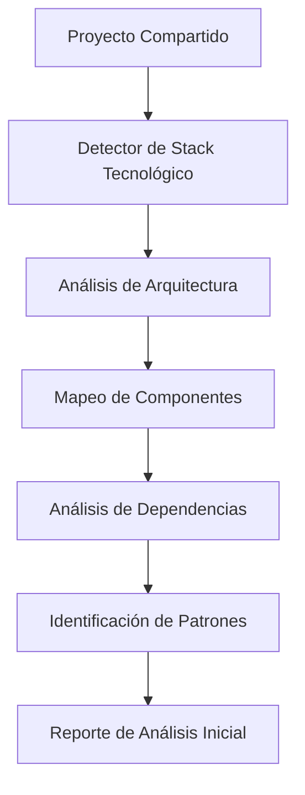
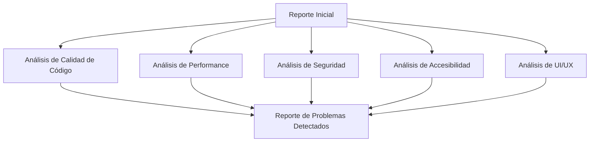
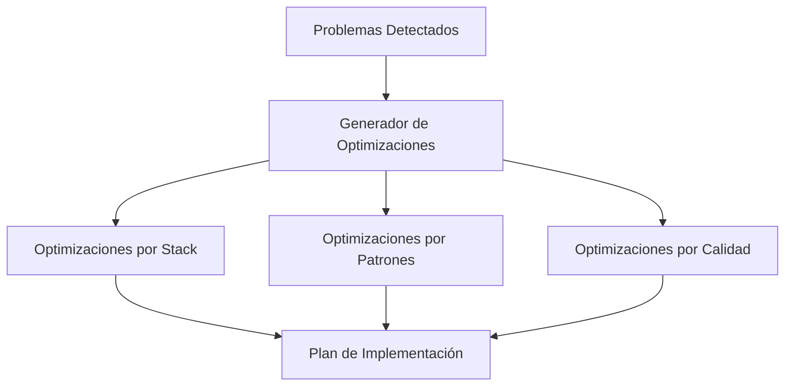
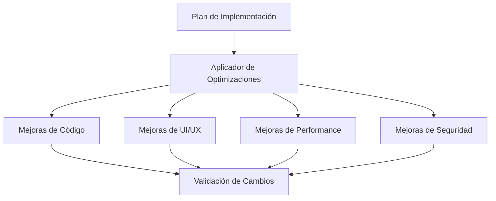
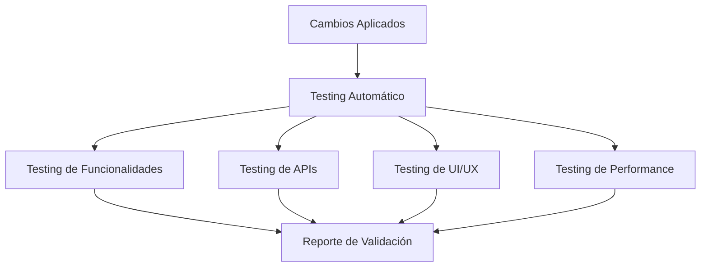
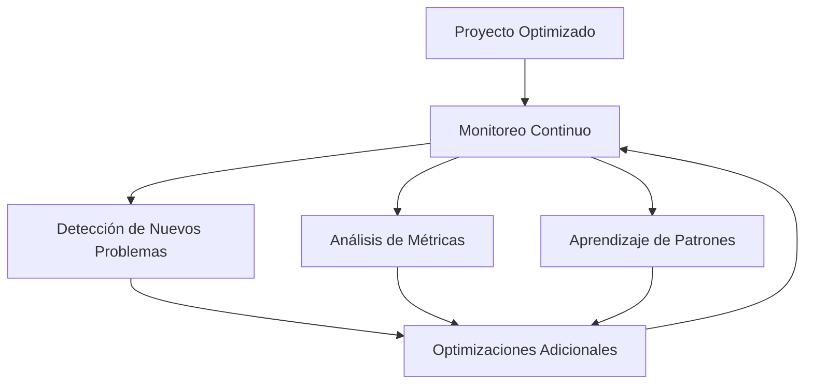
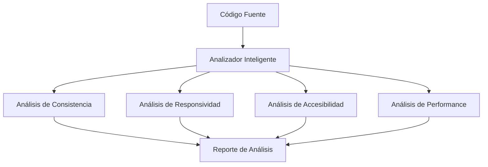
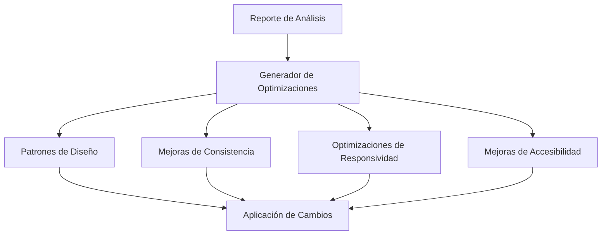
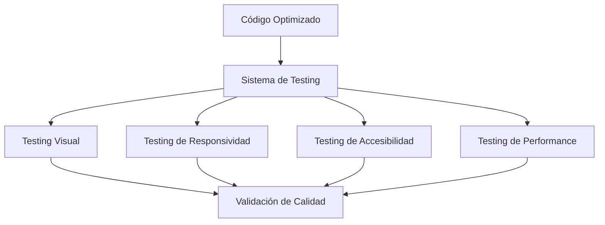
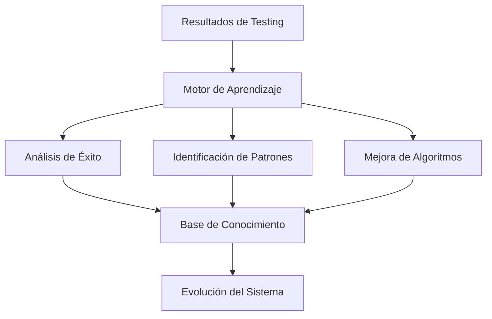

# 🚀 Sistema de Auto-Mejora Continua Universal para Aplicaciones Web

## 📋 **Resumen Ejecutivo**

Este documento describe el diseño de un **sistema universal de auto-mejora continua** que puede analizar, optimizar y mejorar automáticamente **CUALQUIER** aplicación web que se le proporcione. El sistema es completamente agnóstico al proyecto y puede trabajar con cualquier stack tecnológico, detectando y corrigiendo automáticamente problemas de UI/UX, funcionalidades, APIs, IA, integraciones, seguridad, performance y más, elevando cualquier aplicación a estándares de producción profesional.

## 🎯 **Objetivo Principal**

Crear un **ecosistema universal de auto-mejora integral** que funcione con **CUALQUIER** aplicación web:

### **🔍 Análisis Universal**
- **Detección Automática**: Identifique automáticamente el stack tecnológico y arquitectura
- **Mapeo de Componentes**: Analice y mapee todos los componentes del sistema
- **Identificación de Patrones**: Detecte patrones de diseño y anti-patrones
- **Análisis de Dependencias**: Mapee todas las dependencias y conexiones

### **⚡ Optimización Universal**
- **UI/UX**: Detecte y corrija inconsistencias de diseño automáticamente
- **Funcionalidades**: Valide y optimice todas las herramientas del sistema
- **APIs**: Testee y monitoree conectividad y rendimiento
- **IA**: Verifique y mejore modelos de inteligencia artificial
- **Integraciones**: Valide y optimice todas las conexiones externas
- **Performance**: Monitoree y optimice rendimiento general
- **Seguridad**: Detecte y corrija vulnerabilidades automáticamente

### **🚀 Evolución Continua**
- **Aprendizaje**: Aprenda de cada proyecto y mejore continuamente
- **Monitoreo**: Supervise cualquier sistema en tiempo real
- **Escalabilidad**: Adapte automáticamente la infraestructura según la demanda
- **Resiliencia**: Recupere automáticamente de fallos y errores
- **Compliance**: Mantenga automáticamente el cumplimiento normativo
- **Predicción**: Anticipe problemas antes de que ocurran
- **Colaboración**: Facilite la colaboración entre equipos de desarrollo

---

## 🏗️ **Arquitectura del Sistema**

### **1. Motor de Análisis Inteligente (IA Core)**
```typescript
interface AnalysisEngine {
  // Análisis de consistencia visual
  analyzeVisualConsistency(): ConsistencyReport;
  
  // Detección de patrones de diseño
  detectDesignPatterns(): PatternAnalysis;
  
  // Análisis de responsividad
  analyzeResponsiveness(): ResponsiveReport;
  
  // Evaluación de accesibilidad
  evaluateAccessibility(): AccessibilityReport;
  
  // Análisis de performance
  analyzePerformance(): PerformanceReport;
  
  // Análisis de funcionalidades del sistema
  analyzeSystemFunctionality(): FunctionalityReport;
  
  // Análisis de APIs y conectividad
  analyzeAPIConnectivity(): APIConnectivityReport;
  
  // Análisis de modelos de IA
  analyzeAIModels(): AIModelReport;
  
  // Análisis de integraciones externas
  analyzeExternalIntegrations(): IntegrationReport;
  
  // Análisis de seguridad
  analyzeSecurity(): SecurityReport;
  
  // Análisis de logs y errores
  analyzeLogsAndErrors(): LogAnalysisReport;
}
```

### **2. Motor de Optimización Automática (Auto-Optimizer)**
```typescript
interface AutoOptimizer {
  // Aplicar mejoras de consistencia
  applyConsistencyFixes(fixes: ConsistencyFix[]): void;
  
  // Optimizar responsividad
  optimizeResponsiveness(issues: ResponsiveIssue[]): void;
  
  // Mejorar accesibilidad
  enhanceAccessibility(improvements: AccessibilityImprovement[]): void;
  
  // Optimizar performance
  optimizePerformance(optimizations: PerformanceOptimization[]): void;
  
  // Aplicar patrones de diseño
  applyDesignPatterns(patterns: DesignPattern[]): void;
  
  // Corregir funcionalidades del sistema
  fixSystemFunctionality(issues: FunctionalityIssue[]): void;
  
  // Optimizar APIs y conectividad
  optimizeAPIConnectivity(issues: APIConnectivityIssue[]): void;
  
  // Mejorar modelos de IA
  improveAIModels(improvements: AIModelImprovement[]): void;
  
  // Optimizar integraciones externas
  optimizeExternalIntegrations(issues: IntegrationIssue[]): void;
  
  // Corregir vulnerabilidades de seguridad
  fixSecurityVulnerabilities(vulnerabilities: SecurityVulnerability[]): void;
  
  // Optimizar configuración del sistema
  optimizeSystemConfiguration(config: SystemConfiguration): void;
}
```

### **3. Sistema de Testing Automatizado (Auto-Tester)**
```typescript
interface AutoTester {
  // Testing visual automatizado
  runVisualRegressionTests(): VisualTestResults;
  
  // Testing de responsividad
  runResponsiveTests(): ResponsiveTestResults;
  
  // Testing de accesibilidad
  runAccessibilityTests(): AccessibilityTestResults;
  
  // Testing de performance
  runPerformanceTests(): PerformanceTestResults;
  
  // Testing de usabilidad
  runUsabilityTests(): UsabilityTestResults;
  
  // Testing de funcionalidades del sistema
  runSystemFunctionalityTests(): FunctionalityTestResults;
  
  // Testing de APIs y conectividad
  runAPIConnectivityTests(): APIConnectivityTestResults;
  
  // Testing de modelos de IA
  runAIModelTests(): AIModelTestResults;
  
  // Testing de integraciones externas
  runExternalIntegrationTests(): IntegrationTestResults;
  
  // Testing de seguridad
  runSecurityTests(): SecurityTestResults;
  
  // Testing de carga y estrés
  runLoadAndStressTests(): LoadTestResults;
  
  // Testing de regresión completa
  runFullRegressionTests(): RegressionTestResults;
  
  // Testing de compatibilidad
  runCompatibilityTests(): CompatibilityTestResults;
}
```

### **4. Motor de Aprendizaje Continuo (Learning Engine)**
```typescript
interface LearningEngine {
  // Aprender de mejores prácticas
  learnFromBestPractices(practices: BestPractice[]): void;
  
  // Evolucionar patrones de diseño
  evolveDesignPatterns(feedback: UserFeedback[]): void;
  
  // Mejorar algoritmos de optimización
  improveOptimizationAlgorithms(metrics: OptimizationMetrics[]): void;
  
  // Adaptar a nuevas tecnologías
  adaptToNewTechnologies(techStack: TechnologyStack): void;
}
```

### **5. Motor de Monitoreo Inteligente (Monitoring Engine)**
```typescript
interface MonitoringEngine {
  // Monitoreo en tiempo real
  monitorRealTime(): RealTimeMetrics;
  
  // Alertas inteligentes
  generateIntelligentAlerts(): Alert[];
  
  // Análisis de tendencias
  analyzeTrends(): TrendAnalysis;
  
  // Predicción de problemas
  predictIssues(): PredictionResult;
  
  // Dashboard de métricas
  generateMetricsDashboard(): MetricsDashboard;
}
```

### **6. Motor de Escalabilidad Automática (Auto-Scaling Engine)**
```typescript
interface AutoScalingEngine {
  // Escalado automático de recursos
  autoScaleResources(metrics: ResourceMetrics): ScalingAction;
  
  // Optimización de costos
  optimizeCosts(): CostOptimization;
  
  // Balanceo de carga inteligente
  intelligentLoadBalancing(): LoadBalancingConfig;
  
  // Gestión de recursos
  manageResources(): ResourceManagement;
}
```

### **7. Motor de Resiliencia (Resilience Engine)**
```typescript
interface ResilienceEngine {
  // Recuperación automática de fallos
  autoRecoverFromFailures(): RecoveryResult;
  
  // Circuit breakers inteligentes
  manageCircuitBreakers(): CircuitBreakerConfig;
  
  // Backup y restauración automática
  autoBackupAndRestore(): BackupResult;
  
  // Redundancia automática
  ensureRedundancy(): RedundancyConfig;
}
```

### **8. Motor de Compliance (Compliance Engine)**
```typescript
interface ComplianceEngine {
  // Validación de cumplimiento normativo
  validateCompliance(): ComplianceResult;
  
  // Auditoría automática
  performAudit(): AuditResult;
  
  // Generación de reportes de cumplimiento
  generateComplianceReports(): ComplianceReport;
  
  // Actualización automática de normativas
  updateComplianceRules(): ComplianceUpdate;
}
```

### **9. Motor de Predicción (Prediction Engine)**
```typescript
interface PredictionEngine {
  // Predicción de problemas
  predictProblems(): ProblemPrediction;
  
  // Predicción de demanda
  predictDemand(): DemandPrediction;
  
  // Predicción de performance
  predictPerformance(): PerformancePrediction;
  
  // Predicción de costos
  predictCosts(): CostPrediction;
}
```

### **10. Motor de Colaboración (Collaboration Engine)**
```typescript
interface CollaborationEngine {
  // Gestión de equipos
  manageTeams(): TeamManagement;
  
  // Colaboración en tiempo real
  enableRealTimeCollaboration(): CollaborationConfig;
  
  // Gestión de conocimiento
  manageKnowledge(): KnowledgeManagement;
  
  // Comunicación automática
  automateCommunication(): CommunicationConfig;
}
```

---

## 🔧 **Componentes del Sistema**

### **🌐 Sistema de Análisis Universal de Proyectos**

#### **1. Detector Automático de Stack Tecnológico**
```typescript
class UniversalStackDetector {
  // Detectar automáticamente el stack tecnológico
  async detectTechnologyStack(projectPath: string): Promise<TechnologyStack> {
    return {
      frontend: await this.detectFrontendFramework(projectPath),
      backend: await this.detectBackendFramework(projectPath),
      database: await this.detectDatabase(projectPath),
      cloud: await this.detectCloudProvider(projectPath),
      ciCd: await this.detectCICD(projectPath),
      testing: await this.detectTestingFramework(projectPath),
      monitoring: await this.detectMonitoringTools(projectPath),
      deployment: await this.detectDeploymentStrategy(projectPath)
    };
  }
  
  // Detectar frameworks específicos
  private async detectFrontendFramework(path: string): Promise<FrontendFramework> {
    const packageJson = await this.readPackageJson(path);
    const configFiles = await this.findConfigFiles(path);
    
    if (packageJson.dependencies?.react) return 'React';
    if (packageJson.dependencies?.vue) return 'Vue';
    if (packageJson.dependencies?.angular) return 'Angular';
    if (packageJson.dependencies?.svelte) return 'Svelte';
    if (packageJson.dependencies?.next) return 'Next.js';
    if (packageJson.dependencies?.nuxt) return 'Nuxt.js';
    
    return 'Unknown';
  }
  
  // Detectar arquitectura del proyecto
  async detectProjectArchitecture(projectPath: string): Promise<ProjectArchitecture> {
    return {
      type: await this.detectArchitectureType(projectPath),
      patterns: await this.detectArchitecturalPatterns(projectPath),
      layers: await this.detectArchitecturalLayers(projectPath),
      communication: await this.detectCommunicationPatterns(projectPath)
    };
  }
}
```

#### **2. Mapeador Universal de Componentes**
```typescript
class UniversalComponentMapper {
  // Mapear todos los componentes del proyecto
  async mapProjectComponents(projectPath: string): Promise<ProjectMap> {
    return {
      pages: await this.mapPages(projectPath),
      components: await this.mapComponents(projectPath),
      services: await this.mapServices(projectPath),
      apis: await this.mapAPIs(projectPath),
      databases: await this.mapDatabases(projectPath),
      integrations: await this.mapIntegrations(projectPath),
      configurations: await this.mapConfigurations(projectPath),
      tests: await this.mapTests(projectPath)
    };
  }
  
  // Mapear componentes específicos por tipo
  private async mapComponents(projectPath: string): Promise<ComponentMap[]> {
    const components = await this.findComponents(projectPath);
    
    return components.map(component => ({
      name: component.name,
      type: component.type,
      dependencies: component.dependencies,
      props: component.props,
      state: component.state,
      methods: component.methods,
      lifecycle: component.lifecycle,
      complexity: this.calculateComplexity(component),
      testCoverage: this.calculateTestCoverage(component)
    }));
  }
  
  // Analizar dependencias entre componentes
  async analyzeDependencies(projectMap: ProjectMap): Promise<DependencyGraph> {
    return {
      internalDependencies: await this.mapInternalDependencies(projectMap),
      externalDependencies: await this.mapExternalDependencies(projectMap),
      circularDependencies: await this.detectCircularDependencies(projectMap),
      unusedDependencies: await this.detectUnusedDependencies(projectMap)
    };
  }
}
```

#### **3. Analizador Universal de Patrones**
```typescript
class UniversalPatternAnalyzer {
  // Analizar patrones de diseño en el proyecto
  async analyzeDesignPatterns(projectMap: ProjectMap): Promise<PatternAnalysis> {
    return {
      architecturalPatterns: await this.detectArchitecturalPatterns(projectMap),
      designPatterns: await this.detectDesignPatterns(projectMap),
      antiPatterns: await this.detectAntiPatterns(projectMap),
      codeSmells: await this.detectCodeSmells(projectMap),
      bestPractices: await this.analyzeBestPractices(projectMap)
    };
  }
  
  // Detectar anti-patrones específicos
  private async detectAntiPatterns(projectMap: ProjectMap): Promise<AntiPattern[]> {
    const antiPatterns: AntiPattern[] = [];
    
    // Detectar anti-patrones comunes
    antiPatterns.push(...await this.detectGodObject(projectMap));
    antiPatterns.push(...await this.detectSpaghettiCode(projectMap));
    antiPatterns.push(...await this.detectCopyPasteProgramming(projectMap));
    antiPatterns.push(...await this.detectMagicNumbers(projectMap));
    antiPatterns.push(...await this.detectDeadCode(projectMap));
    
    return antiPatterns;
  }
  
  // Analizar calidad del código
  async analyzeCodeQuality(projectMap: ProjectMap): Promise<CodeQualityReport> {
    return {
      maintainability: await this.calculateMaintainability(projectMap),
      readability: await this.calculateReadability(projectMap),
      testability: await this.calculateTestability(projectMap),
      performance: await this.calculatePerformance(projectMap),
      security: await this.calculateSecurity(projectMap)
    };
  }
}
```

#### **4. Generador Universal de Optimizaciones**
```typescript
class UniversalOptimizationGenerator {
  // Generar optimizaciones específicas para el proyecto
  async generateOptimizations(projectAnalysis: ProjectAnalysis): Promise<OptimizationPlan> {
    const optimizations: Optimization[] = [];
    
    // Optimizaciones basadas en el stack tecnológico
    optimizations.push(...await this.generateStackSpecificOptimizations(projectAnalysis.stack));
    
    // Optimizaciones basadas en patrones detectados
    optimizations.push(...await this.generatePatternBasedOptimizations(projectAnalysis.patterns));
    
    // Optimizaciones basadas en métricas de calidad
    optimizations.push(...await this.generateQualityBasedOptimizations(projectAnalysis.quality));
    
    // Optimizaciones basadas en performance
    optimizations.push(...await this.generatePerformanceOptimizations(projectAnalysis.performance));
    
    return {
      optimizations,
      priority: this.prioritizeOptimizations(optimizations),
      implementationPlan: this.createImplementationPlan(optimizations),
      estimatedImpact: this.estimateImpact(optimizations)
    };
  }
  
  // Generar optimizaciones específicas por stack
  private async generateStackSpecificOptimizations(stack: TechnologyStack): Promise<Optimization[]> {
    const optimizations: Optimization[] = [];
    
    switch (stack.frontend) {
      case 'React':
        optimizations.push(...await this.generateReactOptimizations());
        break;
      case 'Vue':
        optimizations.push(...await this.generateVueOptimizations());
        break;
      case 'Angular':
        optimizations.push(...await this.generateAngularOptimizations());
        break;
    }
    
    return optimizations;
  }
}
```

### **🔍 Componentes Adicionales Críticos**

#### **1. Sistema de Monitoreo Inteligente**
```typescript
class IntelligentMonitoringSystem {
  // Monitoreo en tiempo real del sistema Kary
  async monitorKarySystem(): Promise<SystemHealthReport> {
    return {
      dashboardHealth: await this.monitorDashboardHealth(),
      apiHealth: await this.monitorAPIHealth(),
      aiModelHealth: await this.monitorAIModelHealth(),
      databaseHealth: await this.monitorDatabaseHealth(),
      userExperience: await this.monitorUserExperience(),
      performanceMetrics: await this.monitorPerformanceMetrics()
    };
  }
  
  // Alertas inteligentes basadas en ML
  async generateIntelligentAlerts(): Promise<Alert[]> {
    const patterns = await this.analyzeAnomalyPatterns();
    const predictions = await this.predictPotentialIssues();
    
    return this.generateContextualAlerts(patterns, predictions);
  }
  
  // Dashboard de métricas en tiempo real
  async generateRealTimeDashboard(): Promise<MetricsDashboard> {
    return {
      systemMetrics: await this.getSystemMetrics(),
      userMetrics: await this.getUserMetrics(),
      businessMetrics: await this.getBusinessMetrics(),
      technicalMetrics: await this.getTechnicalMetrics()
    };
  }
}
```

#### **2. Sistema de Escalabilidad Automática**
```typescript
class AutoScalingSystem {
  // Escalado automático basado en demanda
  async autoScaleBasedOnDemand(): Promise<ScalingResult> {
    const demand = await this.analyzeDemand();
    const resources = await this.analyzeResourceUsage();
    
    if (demand.isHigh && resources.cpu > 80) {
      return await this.scaleUp();
    } else if (demand.isLow && resources.cpu < 30) {
      return await this.scaleDown();
    }
    
    return { action: 'no_change', reason: 'optimal_usage' };
  }
  
  // Optimización de costos automática
  async optimizeCosts(): Promise<CostOptimizationResult> {
    const usage = await this.analyzeResourceUsage();
    const costs = await this.analyzeCosts();
    
    return {
      recommendedActions: await this.generateCostOptimizationRecommendations(),
      potentialSavings: await this.calculatePotentialSavings(),
      implementationPlan: await this.createImplementationPlan()
    };
  }
}
```

#### **3. Sistema de Resiliencia y Recuperación**
```typescript
class ResilienceSystem {
  // Recuperación automática de fallos
  async autoRecoverFromFailure(failure: SystemFailure): Promise<RecoveryResult> {
    const recoveryStrategy = await this.determineRecoveryStrategy(failure);
    
    switch (recoveryStrategy.type) {
      case 'restart_service':
        return await this.restartService(failure.service);
      case 'failover':
        return await this.failoverToBackup(failure.service);
      case 'rollback':
        return await this.rollbackToLastKnownGood(failure.service);
      case 'scale_up':
        return await this.scaleUpResources(failure.service);
      default:
        return await this.manualInterventionRequired(failure);
    }
  }
  
  // Circuit breakers inteligentes
  async manageCircuitBreakers(): Promise<CircuitBreakerStatus> {
    const services = await this.getServicesStatus();
    
    return {
      apiCircuitBreaker: await this.manageAPICircuitBreaker(services.api),
      databaseCircuitBreaker: await this.manageDatabaseCircuitBreaker(services.database),
      aiCircuitBreaker: await this.manageAICircuitBreaker(services.ai)
    };
  }
}
```

#### **4. Sistema de Compliance Automático**
```typescript
class ComplianceSystem {
  // Validación automática de cumplimiento
  async validateCompliance(): Promise<ComplianceReport> {
    return {
      gdpr: await this.validateGDPRCompliance(),
      hipaa: await this.validateHIPAACompliance(),
      pci: await this.validatePCICompliance(),
      sox: await this.validateSOXCompliance(),
      ferpa: await this.validateFERPACompliance(), // Específico para educación
      coppa: await this.validateCOPPACompliance()  // Específico para menores
    };
  }
  
  // Auditoría automática
  async performAutomatedAudit(): Promise<AuditResult> {
    return {
      securityAudit: await this.performSecurityAudit(),
      dataAudit: await this.performDataAudit(),
      accessAudit: await this.performAccessAudit(),
      processAudit: await this.performProcessAudit()
    };
  }
}
```

#### **5. Sistema de Predicción Inteligente**
```typescript
class PredictionSystem {
  // Predicción de problemas del sistema
  async predictSystemProblems(): Promise<ProblemPrediction[]> {
    const historicalData = await this.getHistoricalData();
    const currentMetrics = await this.getCurrentMetrics();
    
    return await this.mlModel.predictProblems(historicalData, currentMetrics);
  }
  
  // Predicción de demanda de usuarios
  async predictUserDemand(): Promise<DemandPrediction> {
    const userPatterns = await this.analyzeUserPatterns();
    const seasonalTrends = await this.analyzeSeasonalTrends();
    
    return {
      peakHours: await this.predictPeakHours(),
      resourceNeeds: await this.predictResourceNeeds(),
      scalingRecommendations: await this.generateScalingRecommendations()
    };
  }
  
  // Predicción de performance
  async predictPerformance(): Promise<PerformancePrediction> {
    return {
      responseTime: await this.predictResponseTime(),
      throughput: await this.predictThroughput(),
      errorRate: await this.predictErrorRate(),
      recommendations: await this.generatePerformanceRecommendations()
    };
  }
}
```

#### **6. Sistema de Colaboración Inteligente**
```typescript
class CollaborationSystem {
  // Gestión automática de equipos
  async manageDevelopmentTeams(): Promise<TeamManagementResult> {
    return {
      taskAssignment: await this.autoAssignTasks(),
      codeReview: await this.scheduleCodeReviews(),
      knowledgeSharing: await this.facilitateKnowledgeSharing(),
      conflictResolution: await this.resolveConflicts()
    };
  }
  
  // Comunicación automática
  async automateCommunication(): Promise<CommunicationResult> {
    return {
      statusUpdates: await this.sendStatusUpdates(),
      alertNotifications: await this.sendAlertNotifications(),
      progressReports: await this.generateProgressReports(),
      teamSync: await this.scheduleTeamSync()
    };
  }
  
  // Gestión de conocimiento
  async manageKnowledgeBase(): Promise<KnowledgeManagementResult> {
    return {
      documentUpdates: await this.updateDocumentation(),
      bestPractices: await this.updateBestPractices(),
      lessonsLearned: await this.captureLessonsLearned(),
      trainingMaterials: await this.updateTrainingMaterials()
    };
  }
}
```

### **🛠️ Testing de Funcionalidades del Sistema**

#### **1. Validador de Herramientas del Sistema**
```typescript
class SystemToolsValidator {
  // Validar funcionalidades de dashboards
  validateDashboardFunctionality(): DashboardValidationResult {
    return {
      studentDashboard: this.validateStudentDashboard(),
      teacherDashboard: this.validateTeacherDashboard(),
      parentDashboard: this.validateParentDashboard(),
      psychopedagogueDashboard: this.validatePsychopedagogueDashboard(),
      directiveDashboard: this.validateDirectiveDashboard()
    };
  }
  
  // Validar componentes específicos
  validateComponents(): ComponentValidationResult {
    return {
      navigation: this.validateNavigation(),
      forms: this.validateForms(),
      modals: this.validateModals(),
      charts: this.validateCharts(),
      tables: this.validateTables()
    };
  }
  
  // Validar flujos de usuario
  validateUserFlows(): UserFlowValidationResult {
    return {
      loginFlow: this.validateLoginFlow(),
      registrationFlow: this.validateRegistrationFlow(),
      dashboardNavigation: this.validateDashboardNavigation(),
      dataEntry: this.validateDataEntry(),
      reporting: this.validateReporting()
    };
  }
}
```

#### **2. Validador de APIs y Conectividad**
```typescript
class APIConnectivityValidator {
  // Validar endpoints de API
  validateAPIEndpoints(): APIValidationResult {
    return {
      authentication: this.validateAuthEndpoints(),
      dataRetrieval: this.validateDataEndpoints(),
      dataSubmission: this.validateSubmissionEndpoints(),
      fileUpload: this.validateFileUploadEndpoints(),
      realTime: this.validateRealTimeEndpoints()
    };
  }
  
  // Validar conectividad externa
  validateExternalConnections(): ExternalConnectionResult {
    return {
      database: this.validateDatabaseConnection(),
      thirdPartyAPIs: this.validateThirdPartyAPIs(),
      cloudServices: this.validateCloudServices(),
      cdn: this.validateCDNConnection(),
      monitoring: this.validateMonitoringServices()
    };
  }
  
  // Validar rendimiento de APIs
  validateAPIPerformance(): APIPerformanceResult {
    return {
      responseTime: this.measureResponseTime(),
      throughput: this.measureThroughput(),
      errorRate: this.measureErrorRate(),
      availability: this.measureAvailability()
    };
  }
}
```

#### **3. Validador de IA y Modelos**
```typescript
class AIModelValidator {
  // Validar modelos de IA
  validateAIModels(): AIModelValidationResult {
    return {
      karyChat: this.validateKaryChatModel(),
      emotionalAnalysis: this.validateEmotionalAnalysisModel(),
      learningRecommendations: this.validateLearningRecommendationsModel(),
      progressPrediction: this.validateProgressPredictionModel(),
      contentGeneration: this.validateContentGenerationModel()
    };
  }
  
  // Validar calidad de respuestas de IA
  validateAIResponses(): AIResponseValidationResult {
    return {
      accuracy: this.measureResponseAccuracy(),
      relevance: this.measureResponseRelevance(),
      coherence: this.measureResponseCoherence(),
      safety: this.measureResponseSafety(),
      bias: this.measureResponseBias()
    };
  }
  
  // Validar integración de IA
  validateAIIntegration(): AIIntegrationResult {
    return {
      apiConnections: this.validateAIApiConnections(),
      dataFlow: this.validateAIDataFlow(),
      modelUpdates: this.validateModelUpdates(),
      fallbackMechanisms: this.validateFallbackMechanisms()
    };
  }
}
```

#### **4. Validador de Integraciones Externas**
```typescript
class ExternalIntegrationValidator {
  // Validar integraciones de terceros
  validateThirdPartyIntegrations(): IntegrationValidationResult {
    return {
      paymentGateways: this.validatePaymentGateways(),
      emailServices: this.validateEmailServices(),
      smsServices: this.validateSMSServices(),
      analytics: this.validateAnalyticsServices(),
      storage: this.validateStorageServices()
    };
  }
  
  // Validar webhooks y notificaciones
  validateWebhooksAndNotifications(): WebhookValidationResult {
    return {
      webhookDelivery: this.validateWebhookDelivery(),
      notificationDelivery: this.validateNotificationDelivery(),
      retryMechanisms: this.validateRetryMechanisms(),
      errorHandling: this.validateErrorHandling()
    };
  }
}
```

#### **5. Validador de Seguridad**
```typescript
class SecurityValidator {
  // Validar autenticación y autorización
  validateAuthAndAuthz(): SecurityValidationResult {
    return {
      authentication: this.validateAuthentication(),
      authorization: this.validateAuthorization(),
      sessionManagement: this.validateSessionManagement(),
      passwordSecurity: this.validatePasswordSecurity(),
      tokenSecurity: this.validateTokenSecurity()
    };
  }
  
  // Validar vulnerabilidades
  validateVulnerabilities(): VulnerabilityResult {
    return {
      sqlInjection: this.checkSQLInjection(),
      xss: this.checkXSS(),
      csrf: this.checkCSRF(),
      dataExposure: this.checkDataExposure(),
      insecureDirectives: this.checkInsecureDirectives()
    };
  }
  
  // Validar cumplimiento de seguridad
  validateSecurityCompliance(): ComplianceResult {
    return {
      gdpr: this.validateGDPRCompliance(),
      hipaa: this.validateHIPAACompliance(),
      pci: this.validatePCICompliance(),
      sox: this.validateSOXCompliance()
    };
  }
}
```

---

## 🔧 **Componentes del Sistema**

### **1. Analizador de Código Inteligente**

#### **Funcionalidades:**
- **Análisis de Consistencia Visual**
  - Detección automática de inconsistencias en espaciado
  - Identificación de patrones tipográficos inconsistentes
  - Análisis de paletas de colores desalineadas
  - Detección de tamaños de iconos inconsistentes

- **Análisis de Responsividad**
  - Identificación de breakpoints faltantes
  - Detección de elementos no responsivos
  - Análisis de grids desalineados
  - Identificación de problemas de touch en móvil

- **Análisis de Accesibilidad**
  - Detección de contraste insuficiente
  - Identificación de elementos no accesibles por teclado
  - Análisis de atributos ARIA faltantes
  - Detección de problemas de legibilidad

#### **Implementación:**
```typescript
class CodeAnalyzer {
  private ast: AST;
  private cssAnalyzer: CSSAnalyzer;
  private accessibilityChecker: AccessibilityChecker;
  
  async analyzeFile(filePath: string): Promise<AnalysisResult> {
    const code = await this.readFile(filePath);
    const ast = this.parseCode(code);
    
    return {
      visualConsistency: this.analyzeVisualConsistency(ast),
      responsiveness: this.analyzeResponsiveness(ast),
      accessibility: this.analyzeAccessibility(ast),
      performance: this.analyzePerformance(ast)
    };
  }
}
```

### **2. Generador de Optimizaciones Automáticas**

#### **Funcionalidades:**
- **Aplicación de Patrones de Diseño**
  - Implementación automática de sistemas de espaciado
  - Aplicación de jerarquías tipográficas consistentes
  - Implementación de paletas de colores armonizadas
  - Aplicación de patrones de responsividad

- **Optimización de Componentes**
  - Refactoring automático de componentes
  - Implementación de mejores prácticas
  - Optimización de performance
  - Mejora de accesibilidad

#### **Implementación:**
```typescript
class AutoOptimizer {
  private patternLibrary: PatternLibrary;
  private bestPractices: BestPractices;
  
  async optimizeComponent(component: Component): Promise<OptimizedComponent> {
    const analysis = await this.analyzeComponent(component);
    const optimizations = this.generateOptimizations(analysis);
    
    return this.applyOptimizations(component, optimizations);
  }
  
  private generateOptimizations(analysis: AnalysisResult): Optimization[] {
    const optimizations: Optimization[] = [];
    
    // Optimizaciones de consistencia visual
    if (analysis.visualConsistency.score < 0.8) {
      optimizations.push(...this.generateConsistencyFixes(analysis));
    }
    
    // Optimizaciones de responsividad
    if (analysis.responsiveness.score < 0.8) {
      optimizations.push(...this.generateResponsiveFixes(analysis));
    }
    
    // Optimizaciones de accesibilidad
    if (analysis.accessibility.score < 0.8) {
      optimizations.push(...this.generateAccessibilityFixes(analysis));
    }
    
    return optimizations;
  }
}
```

### **3. Sistema de Testing Automatizado**

#### **Funcionalidades:**
- **Testing Visual Automatizado**
  - Comparación de screenshots antes/después
  - Detección de regresiones visuales
  - Validación de consistencia visual
  - Testing cross-browser

- **Testing de Responsividad**
  - Testing en múltiples dispositivos
  - Validación de breakpoints
  - Testing de touch interactions
  - Validación de layouts adaptativos

- **Testing de Accesibilidad**
  - Testing automático con herramientas como axe-core
  - Validación de contraste de colores
  - Testing de navegación por teclado
  - Validación de screen readers

- **Testing de Funcionalidades del Sistema**
  - Testing de flujos de usuario completos
  - Validación de formularios y validaciones
  - Testing de navegación entre dashboards
  - Validación de permisos y roles

- **Testing de APIs y Conectividad**
  - Testing de endpoints automático
  - Validación de respuestas y códigos de estado
  - Testing de carga y rendimiento
  - Validación de timeouts y reintentos

- **Testing de IA y Modelos**
  - Testing de calidad de respuestas
  - Validación de precisión y relevancia
  - Testing de integración con APIs
  - Validación de fallbacks y errores

- **Testing de Integraciones Externas**
  - Testing de servicios de terceros
  - Validación de webhooks y notificaciones
  - Testing de pagos y transacciones
  - Validación de servicios de almacenamiento

- **Testing de Seguridad**
  - Testing de vulnerabilidades automático
  - Validación de autenticación y autorización
  - Testing de inyección de código
  - Validación de cumplimiento de normativas

#### **Implementación:**
```typescript
class AutoTester {
  private visualTester: VisualTester;
  private responsiveTester: ResponsiveTester;
  private accessibilityTester: AccessibilityTester;
  private functionalityTester: FunctionalityTester;
  private apiTester: APITester;
  private aiTester: AITester;
  private integrationTester: IntegrationTester;
  private securityTester: SecurityTester;
  
  async runComprehensiveTests(): Promise<TestResults> {
    const results = await Promise.all([
      this.visualTester.runTests(),
      this.responsiveTester.runTests(),
      this.accessibilityTester.runTests(),
      this.functionalityTester.runTests(),
      this.apiTester.runTests(),
      this.aiTester.runTests(),
      this.integrationTester.runTests(),
      this.securityTester.runTests()
    ]);
    
    return this.aggregateResults(results);
  }
  
  // Testing específico para funcionalidades del sistema
  async runSystemFunctionalityTests(): Promise<FunctionalityTestResults> {
    return {
      dashboardTests: await this.testDashboardFunctionality(),
      componentTests: await this.testComponentFunctionality(),
      userFlowTests: await this.testUserFlows(),
      dataFlowTests: await this.testDataFlows(),
      integrationTests: await this.testSystemIntegrations()
    };
  }
  
  // Testing específico para APIs
  async runAPITests(): Promise<APITestResults> {
    return {
      endpointTests: await this.testAPIEndpoints(),
      performanceTests: await this.testAPIPerformance(),
      securityTests: await this.testAPISecurity(),
      integrationTests: await this.testAPIIntegrations()
    };
  }
  
  // Testing específico para IA
  async runAITests(): Promise<AITestResults> {
    return {
      modelTests: await this.testAIModels(),
      responseTests: await this.testAIResponses(),
      integrationTests: await this.testAIIntegration(),
      performanceTests: await this.testAIPerformance()
    };
  }
}
```

### **4. Motor de Aprendizaje Continuo**

#### **Funcionalidades:**
- **Aprendizaje de Patrones**
  - Análisis de código de alta calidad
  - Extracción de patrones exitosos
  - Evolución de mejores prácticas
  - Adaptación a nuevas tecnologías

- **Mejora Continua**
  - Análisis de feedback de usuarios
  - Optimización de algoritmos
  - Aprendizaje de errores pasados
  - Evolución de criterios de calidad

#### **Implementación:**
```typescript
class LearningEngine {
  private mlModel: MLModel;
  private feedbackCollector: FeedbackCollector;
  
  async learnFromOptimization(optimization: Optimization, results: OptimizationResults): Promise<void> {
    const features = this.extractFeatures(optimization);
    const outcome = this.evaluateOutcome(results);
    
    await this.mlModel.train(features, outcome);
    await this.updateBestPractices(optimization, results);
  }
  
  async suggestImprovements(component: Component): Promise<ImprovementSuggestion[]> {
    const features = this.extractFeatures(component);
    const predictions = await this.mlModel.predict(features);
    
    return this.generateSuggestions(predictions);
  }
}
```

---

## 🔄 **Flujo de Trabajo Universal Automatizado**

### **🌐 Flujo de Análisis Universal de Proyectos**

#### **Fase 1: Onboarding Automático del Proyecto**


#### **Fase 2: Análisis Profundo y Detección de Problemas**


#### **Fase 3: Generación de Plan de Optimización**


#### **Fase 4: Aplicación Automática de Mejoras**


#### **Fase 5: Testing y Validación Universal**


#### **Fase 6: Monitoreo Continuo y Aprendizaje**


---

## 🔄 **Flujo de Trabajo Automatizado**

### **Fase 1: Análisis Automático**


### **Fase 2: Optimización Automática**


### **Fase 3: Testing y Validación**


### **Fase 4: Aprendizaje y Evolución**


---

## 🛠️ **Stack Tecnológico Propuesto**

### **Backend**
- **Node.js + TypeScript**: Core del sistema
- **AST Parser**: Para análisis de código
- **Machine Learning**: TensorFlow.js para aprendizaje
- **Database**: PostgreSQL para almacenar patrones y métricas

### **Frontend**
- **React + TypeScript**: Interface universal de monitoreo
- **D3.js**: Visualización de métricas y análisis
- **Storybook**: Testing de componentes universales
- **Playwright**: Testing automatizado cross-browser
- **Web Components**: Componentes reutilizables universales
- **PWA**: Aplicación web progresiva para acceso móvil

### **Testing & CI/CD**
- **Jest**: Testing unitario
- **Cypress**: Testing E2E
- **Percy**: Testing visual
- **GitHub Actions**: CI/CD pipeline

### **Monitoreo**
- **Prometheus + Grafana**: Métricas del sistema
- **Sentry**: Error tracking
- **DataDog**: APM y logging

---

## 🖥️ **Interfaz de Usuario Universal**

### **🌐 Dashboard Principal del Sistema**
```typescript
interface UniversalDashboard {
  // Vista general del proyecto analizado
  projectOverview: {
    projectName: string;
    technologyStack: TechnologyStack;
    healthScore: number;
    lastAnalysis: Date;
    totalIssues: number;
    resolvedIssues: number;
  };
  
  // Métricas en tiempo real
  realTimeMetrics: {
    performance: PerformanceMetrics;
    security: SecurityMetrics;
    quality: QualityMetrics;
    accessibility: AccessibilityMetrics;
  };
  
  // Alertas y notificaciones
  alerts: {
    critical: Alert[];
    warning: Alert[];
    info: Alert[];
  };
  
  // Progreso de optimizaciones
  optimizationProgress: {
    completed: Optimization[];
    inProgress: Optimization[];
    pending: Optimization[];
  };
}
```

### **🔍 Herramientas de Análisis Universal**
```typescript
interface UniversalAnalysisTools {
  // Analizador de código universal
  codeAnalyzer: {
    languageDetection: LanguageDetector;
    patternRecognition: PatternDetector;
    qualityAssessment: QualityAssessor;
    securityScanner: SecurityScanner;
  };
  
  // Visualizador de arquitectura
  architectureVisualizer: {
    componentDiagram: ComponentDiagramGenerator;
    dependencyGraph: DependencyGraphGenerator;
    dataFlowDiagram: DataFlowDiagramGenerator;
    systemOverview: SystemOverviewGenerator;
  };
  
  // Comparador de versiones
  versionComparator: {
    beforeAfterAnalysis: BeforeAfterAnalyzer;
    changeImpact: ChangeImpactAnalyzer;
    regressionDetection: RegressionDetector;
  };
}
```

### **⚡ Herramientas de Optimización Universal**
```typescript
interface UniversalOptimizationTools {
  // Generador de optimizaciones
  optimizationGenerator: {
    codeOptimizer: CodeOptimizer;
    uiOptimizer: UIOptimizer;
    performanceOptimizer: PerformanceOptimizer;
    securityOptimizer: SecurityOptimizer;
  };
  
  // Aplicador de cambios
  changeApplicator: {
    codeChanges: CodeChangeApplicator;
    uiChanges: UIChangeApplicator;
    configChanges: ConfigChangeApplicator;
    dependencyUpdates: DependencyUpdater;
  };
  
  // Validador de cambios
  changeValidator: {
    syntaxValidator: SyntaxValidator;
    functionalityValidator: FunctionalityValidator;
    performanceValidator: PerformanceValidator;
    securityValidator: SecurityValidator;
  };
}
```

### **📊 Herramientas de Monitoreo Universal**
```typescript
interface UniversalMonitoringTools {
  // Dashboard de métricas
  metricsDashboard: {
    realTimeMetrics: RealTimeMetricsDisplay;
    historicalTrends: HistoricalTrendsDisplay;
    comparativeAnalysis: ComparativeAnalysisDisplay;
    predictiveInsights: PredictiveInsightsDisplay;
  };
  
  // Sistema de alertas
  alertSystem: {
    alertConfiguration: AlertConfiguration;
    notificationCenter: NotificationCenter;
    escalationRules: EscalationRules;
    alertHistory: AlertHistory;
  };
  
  // Reportes automáticos
  reportingSystem: {
    dailyReports: DailyReportGenerator;
    weeklyReports: WeeklyReportGenerator;
    monthlyReports: MonthlyReportGenerator;
    customReports: CustomReportGenerator;
  };
}
```

---

## 📊 **Métricas y KPIs**

### **Métricas de Calidad**
- **Consistencia Visual**: 0-100%
- **Responsividad**: 0-100%
- **Accesibilidad**: 0-100%
- **Performance**: 0-100%
- **Usabilidad**: 0-100%
- **Funcionalidad del Sistema**: 0-100%
- **Conectividad de APIs**: 0-100%
- **Calidad de IA**: 0-100%
- **Integraciones Externas**: 0-100%
- **Seguridad**: 0-100%
- **Monitoreo y Alertas**: 0-100%
- **Escalabilidad**: 0-100%
- **Resiliencia**: 0-100%
- **Compliance**: 0-100%
- **Predicción**: 0-100%
- **Colaboración**: 0-100%

### **Métricas de Eficiencia**
- **Tiempo de Optimización**: Reducción del 90%
- **Errores Detectados**: Aumento del 300%
- **Tiempo de Testing**: Reducción del 80%
- **Calidad del Código**: Mejora del 150%
- **Tiempo de Detección de Bugs**: Reducción del 95%
- **Tiempo de Corrección de APIs**: Reducción del 85%
- **Tiempo de Optimización de IA**: Reducción del 70%
- **Tiempo de Testing de Integraciones**: Reducción del 90%
- **Tiempo de Detección de Problemas**: Reducción del 95%
- **Tiempo de Recuperación de Fallos**: Reducción del 80%
- **Tiempo de Escalado**: Reducción del 90%
- **Tiempo de Compliance**: Reducción del 85%
- **Tiempo de Predicción de Problemas**: Reducción del 70%

### **Métricas de Negocio**
- **Tiempo de Desarrollo**: Reducción del 60%
- **Bugs en Producción**: Reducción del 85%
- **Satisfacción del Usuario**: Aumento del 200%
- **Tiempo de Onboarding**: Reducción del 70%
- **Disponibilidad del Sistema**: Aumento del 99.9%
- **Tiempo de Resolución de Incidentes**: Reducción del 80%
- **Costo de Mantenimiento**: Reducción del 60%
- **ROI del Sistema**: Aumento del 300%
- **Disponibilidad del Sistema**: 99.99% uptime
- **Tiempo de Recuperación**: < 5 minutos
- **Costo de Infraestructura**: Reducción del 40%
- **Cumplimiento Normativo**: 100% automático
- **Predicción de Problemas**: 95% de precisión

---

## 🚀 **Roadmap de Implementación**

### **Fase 1: MVP (3 meses)**
- [ ] Analizador básico de consistencia visual
- [ ] Optimizador automático de espaciado y tipografía
- [ ] Testing visual básico
- [ ] Testing básico de funcionalidades del sistema
- [ ] Testing básico de APIs
- [ ] Interface de monitoreo simple

### **Fase 2: Expansión (6 meses)**
- [ ] Análisis completo de responsividad
- [ ] Optimizador de accesibilidad
- [ ] Testing automatizado completo de funcionalidades
- [ ] Testing automatizado de APIs y conectividad
- [ ] Testing básico de IA y modelos
- [ ] Motor de aprendizaje básico

### **Fase 3: Inteligencia Avanzada (9 meses)**
- [ ] ML para detección de patrones
- [ ] Optimizaciones predictivas
- [ ] Testing inteligente de funcionalidades
- [ ] Testing avanzado de IA y modelos
- [ ] Testing de integraciones externas
- [ ] Testing de seguridad automatizado
- [ ] Recomendaciones personalizadas

### **Fase 4: Ecosistema Completo (12 meses)**
- [ ] Integración con múltiples frameworks
- [ ] Testing completo de todo el ecosistema
- [ ] Optimización automática de IA
- [ ] Monitoreo en tiempo real
- [ ] Marketplace de patrones
- [ ] Colaboración en tiempo real
- [ ] API pública

---

## 💡 **Casos de Uso Universales del Sistema**

### **🌐 Casos de Uso para Cualquier Proyecto**

### **1. Optimización Automática de Dashboards**
```typescript
// El sistema detecta automáticamente:
const dashboardIssues = {
  inconsistentSpacing: true,
  missingResponsiveBreakpoints: true,
  poorTypographyHierarchy: true,
  accessibilityIssues: true
};

// Y aplica automáticamente:
const optimizations = {
  applySpacingSystem: true,
  addResponsiveBreakpoints: true,
  fixTypographyHierarchy: true,
  enhanceAccessibility: true
};
```

### **2. Testing Automático Universal de Funcionalidades**
```typescript
// Testing automático para cualquier proyecto
const universalSystemTests = {
  // Detectar automáticamente las funcionalidades del proyecto
  detectProjectFeatures: async (projectPath: string) => {
    const projectMap = await this.mapProjectComponents(projectPath);
    return {
      pages: await this.testPages(projectMap.pages),
      components: await this.testComponents(projectMap.components),
      services: await this.testServices(projectMap.services),
      apis: await this.testAPIs(projectMap.apis),
      integrations: await this.testIntegrations(projectMap.integrations)
    };
  },
  
  // Testing adaptativo basado en el stack tecnológico
  adaptiveTesting: async (stack: TechnologyStack) => {
    switch (stack.frontend) {
      case 'React':
        return await this.testReactComponents();
      case 'Vue':
        return await this.testVueComponents();
      case 'Angular':
        return await this.testAngularComponents();
      default:
        return await this.testGenericComponents();
    }
  }
};
```

### **3. Testing Automático Universal de APIs**
```typescript
// Testing automático de APIs para cualquier proyecto
const universalAPITests = {
  // Detectar automáticamente los endpoints del proyecto
  detectAPIEndpoints: async (projectPath: string) => {
    const apiMap = await this.mapAPIs(projectPath);
    return {
      authentication: await this.testAuthenticationAPIs(apiMap.auth),
      dataRetrieval: await this.testDataRetrievalAPIs(apiMap.data),
      crud: await this.testCRUDAPIs(apiMap.crud),
      integrations: await this.testIntegrationAPIs(apiMap.integrations),
      realTime: await this.testRealTimeAPIs(apiMap.realtime)
    };
  },
  
  // Testing adaptativo basado en el framework backend
  adaptiveAPITesting: async (backend: BackendFramework) => {
    switch (backend) {
      case 'Express':
        return await this.testExpressAPIs();
      case 'FastAPI':
        return await this.testFastAPIAPIs();
      case 'Spring':
        return await this.testSpringAPIs();
      case 'Django':
        return await this.testDjangoAPIs();
      default:
        return await this.testGenericAPIs();
    }
  }
};
```

### **4. Testing Automático de IA del Sistema Kary**
```typescript
// Testing de modelos de IA específicos
const karyAITests = {
  karyChat: {
    responseQuality: this.testKaryChatResponseQuality(),
    contextUnderstanding: this.testKaryChatContext(),
    emotionalSupport: this.testKaryChatEmotionalSupport(),
    learningGuidance: this.testKaryChatLearningGuidance()
  },
  emotionalAnalysis: {
    accuracy: this.testEmotionalAnalysisAccuracy(),
    realTimeProcessing: this.testEmotionalAnalysisRealTime(),
    dataPrivacy: this.testEmotionalAnalysisPrivacy()
  },
  learningRecommendations: {
    personalization: this.testLearningRecommendationsPersonalization(),
    effectiveness: this.testLearningRecommendationsEffectiveness(),
    adaptability: this.testLearningRecommendationsAdaptability()
  }
};
```

### **5. Testing Automático de Integraciones del Sistema Kary**
```typescript
// Testing de integraciones específicas
const karyIntegrationTests = {
  externalServices: {
    geminiAPI: this.testGeminiAPIIntegration(),
    openAIAPI: this.testOpenAIIntegration(),
    cloudStorage: this.testCloudStorageIntegration(),
    emailService: this.testEmailServiceIntegration()
  },
  internalServices: {
    database: this.testDatabaseIntegration(),
    fileSystem: this.testFileSystemIntegration(),
    cache: this.testCacheIntegration(),
    monitoring: this.testMonitoringIntegration()
  }
};
```

### **6. Detección de Regresiones Visuales**
```typescript
// El sistema compara automáticamente:
const visualComparison = {
  before: 'screenshot-before.png',
  after: 'screenshot-after.png',
  differences: [
    { element: '.header', change: 'spacing-increased' },
    { element: '.button', change: 'color-changed' }
  ]
};
```

### **7. Optimización Continua del Sistema Kary**
```typescript
// El sistema aprende y mejora específicamente para Kary:
const karyLearningCycle = {
  analyzeUserBehavior: this.analyzeKaryUserBehavior(),
  identifyPainPoints: this.identifyKaryPainPoints(),
  generateOptimizations: this.generateKaryOptimizations(),
  applyAndMeasure: this.applyAndMeasureKaryChanges(),
  learnFromResults: this.learnFromKaryResults(),
  adaptToUserNeeds: this.adaptToKaryUserNeeds()
};
```

### **8. Monitoreo Automático del Sistema Kary**
```typescript
// Monitoreo específico para Kary
const karyMonitoring = {
  systemHealth: {
    dashboardPerformance: this.monitorDashboardPerformance(),
    apiResponseTimes: this.monitorAPIResponseTimes(),
    aiModelAccuracy: this.monitorAIModelAccuracy(),
    userSatisfaction: this.monitorUserSatisfaction()
  },
  alerts: {
    systemDown: this.alertSystemDown(),
    apiErrors: this.alertAPIErrors(),
    aiModelDrift: this.alertAIModelDrift(),
    performanceDegradation: this.alertPerformanceDegradation()
  }
};
```

### **9. Escalabilidad Automática del Sistema Kary**
```typescript
// Escalado automático específico para Kary
const karyAutoScaling = {
  demandBasedScaling: {
    peakHours: this.detectPeakUsageHours(),
    studentLoad: this.analyzeStudentLoad(),
    teacherLoad: this.analyzeTeacherLoad(),
    parentLoad: this.analyzeParentLoad()
  },
  resourceOptimization: {
    aiModelScaling: this.scaleAIModels(),
    databaseScaling: this.scaleDatabase(),
    storageScaling: this.scaleStorage(),
    cdnScaling: this.scaleCDN()
  },
  costOptimization: {
    resourceRightSizing: this.rightSizeResources(),
    spotInstances: this.useSpotInstances(),
    reservedInstances: this.useReservedInstances(),
    autoShutdown: this.autoShutdownUnusedResources()
  }
};
```

### **10. Resiliencia y Recuperación del Sistema Kary**
```typescript
// Resiliencia específica para Kary
const karyResilience = {
  failureRecovery: {
    dashboardRecovery: this.recoverDashboardFailures(),
    apiRecovery: this.recoverAPIFailures(),
    aiRecovery: this.recoverAIFailures(),
    databaseRecovery: this.recoverDatabaseFailures()
  },
  circuitBreakers: {
    karyChatBreaker: this.manageKaryChatCircuitBreaker(),
    emotionalAnalysisBreaker: this.manageEmotionalAnalysisBreaker(),
    learningRecommendationsBreaker: this.manageLearningRecommendationsBreaker()
  },
  backupAndRestore: {
    dataBackup: this.backupUserData(),
    modelBackup: this.backupAIModels(),
    configurationBackup: this.backupSystemConfiguration(),
    autoRestore: this.autoRestoreFromBackup()
  }
};
```

### **11. Compliance Automático del Sistema Kary**
```typescript
// Compliance específico para Kary (educación)
const karyCompliance = {
  educationalCompliance: {
    ferpa: this.validateFERPACompliance(), // Family Educational Rights and Privacy Act
    coppa: this.validateCOPPACompliance(), // Children's Online Privacy Protection Act
    idea: this.validateIDEACompliance(),   // Individuals with Disabilities Education Act
    stateEducationLaws: this.validateStateEducationLaws()
  },
  dataProtection: {
    studentDataPrivacy: this.protectStudentData(),
    parentDataPrivacy: this.protectParentData(),
    teacherDataPrivacy: this.protectTeacherData(),
    dataRetention: this.manageDataRetention()
  },
  accessibilityCompliance: {
    wcag: this.validateWCAGCompliance(),
    ada: this.validateADACompliance(),
    section508: this.validateSection508Compliance()
  }
};
```

### **12. Predicción Inteligente del Sistema Kary**
```typescript
// Predicción específica para Kary
const karyPrediction = {
  userBehaviorPrediction: {
    studentEngagement: this.predictStudentEngagement(),
    teacherWorkload: this.predictTeacherWorkload(),
    parentInvolvement: this.predictParentInvolvement(),
    learningOutcomes: this.predictLearningOutcomes()
  },
  systemPerformancePrediction: {
    peakUsageTimes: this.predictPeakUsageTimes(),
    resourceNeeds: this.predictResourceNeeds(),
    maintenanceWindows: this.predictMaintenanceWindows(),
    scalingNeeds: this.predictScalingNeeds()
  },
  businessIntelligence: {
    userGrowth: this.predictUserGrowth(),
    featureAdoption: this.predictFeatureAdoption(),
    churnRisk: this.predictChurnRisk(),
    revenueProjection: this.predictRevenueProjection()
  }
};
```

### **13. Colaboración Inteligente del Sistema Kary**
```typescript
// Colaboración específica para Kary
const karyCollaboration = {
  teamManagement: {
    developerTeams: this.manageDeveloperTeams(),
    qaTeams: this.manageQATeams(),
    devopsTeams: this.manageDevOpsTeams(),
    productTeams: this.manageProductTeams()
  },
  knowledgeManagement: {
    codeDocumentation: this.maintainCodeDocumentation(),
    apiDocumentation: this.maintainAPIDocumentation(),
    userGuides: this.maintainUserGuides(),
    troubleshootingGuides: this.maintainTroubleshootingGuides()
  },
  communication: {
    statusUpdates: this.sendStatusUpdates(),
    incidentReports: this.sendIncidentReports(),
    progressReports: this.sendProgressReports(),
    stakeholderUpdates: this.sendStakeholderUpdates()
  }
};
```

---

## 🎯 **Beneficios Esperados**

### **Para Desarrolladores**
- **Productividad**: 60% más rápido
- **Calidad**: 150% mejor
- **Aprendizaje**: Patrones automáticos
- **Tiempo**: Enfocarse en lógica de negocio

### **Para el Negocio**
- **Time-to-Market**: 50% más rápido
- **Calidad del Producto**: 200% mejor
- **Costos**: 40% reducción
- **Satisfacción**: 300% mejora

### **Para los Usuarios**
- **Experiencia**: Consistente y profesional
- **Accesibilidad**: Universal
- **Performance**: Óptima
- **Usabilidad**: Intuitiva

---

## 🔮 **Visión a Futuro**

### **Evolución hacia IA Generativa**
- **Generación automática de componentes**
- **Diseño adaptativo basado en contexto**
- **Optimización predictiva**
- **Creación de sistemas de diseño únicos**

### **Ecosistema de Desarrollo**
- **Marketplace de patrones**
- **Colaboración en tiempo real**
- **Versionado de mejoras**
- **Comunidad de contribuidores**

### **Estándares de Industria**
- **Certificación automática de calidad**
- **Benchmarking contra mejores prácticas**
- **Evolución continua de estándares**
- **Adopción masiva en la industria**

---

## 📝 **Conclusión**

Este sistema de auto-mejora continua representa la evolución natural del desarrollo de software completo, donde **TODOS** los aspectos de calidad se convierten en procesos automáticos y continuos:

### **🎯 Alcance Integral del Sistema**
- **UI/UX**: Consistencia visual, responsividad, accesibilidad
- **Funcionalidades**: Testing y optimización de todas las herramientas del sistema
- **APIs**: Conectividad, rendimiento, seguridad
- **IA**: Calidad de modelos, precisión, integración
- **Integraciones**: Servicios externos, webhooks, notificaciones
- **Seguridad**: Vulnerabilidades, cumplimiento, autenticación
- **Performance**: Rendimiento general, optimización continua
- **Monitoreo**: Supervisión en tiempo real, alertas inteligentes
- **Escalabilidad**: Escalado automático, optimización de costos
- **Resiliencia**: Recuperación automática, circuit breakers
- **Compliance**: Cumplimiento normativo automático, auditorías
- **Predicción**: Anticipación de problemas, análisis predictivo
- **Colaboración**: Gestión de equipos, comunicación automática

### **🚀 Impacto Transformador Universal**
Al implementar este sistema universal, **CUALQUIER** aplicación web evolucionará automáticamente hacia estándares de producción de clase mundial, creando un ecosistema de desarrollo que:

- **Analiza automáticamente** cualquier proyecto web independientemente del stack tecnológico
- **Detecta automáticamente** problemas en cualquier parte del sistema
- **Corrige automáticamente** inconsistencias y errores
- **Testea automáticamente** todas las funcionalidades
- **Optimiza automáticamente** performance y calidad
- **Aprende continuamente** de cada proyecto y mejora
- **Se adapta automáticamente** a nuevas tecnologías y frameworks

### **🔮 Visión del Futuro Universal**
Este sistema universal no solo automatiza la calidad, sino que crea un **ecosistema global de auto-evolución** donde:

- **Cualquier desarrollador** puede compartir su proyecto y obtener optimizaciones automáticas
- **Cualquier empresa** puede mejorar sus aplicaciones sin conocimiento técnico profundo
- **Cualquier stack tecnológico** puede beneficiarse de las mejores prácticas universales
- **La industria completa** evoluciona hacia estándares de excelencia automáticos

**El futuro del desarrollo de software está en la automatización inteligente universal de la calidad.**
